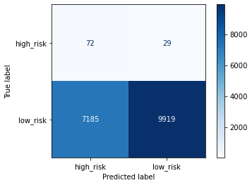
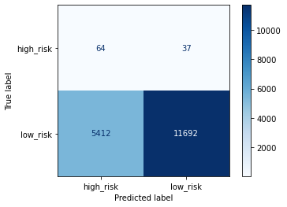
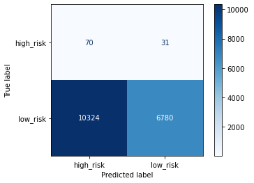
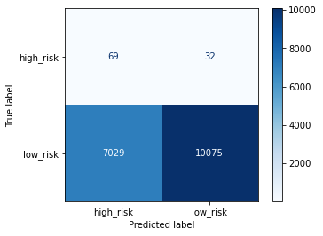
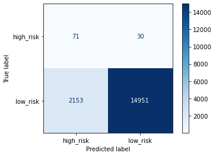
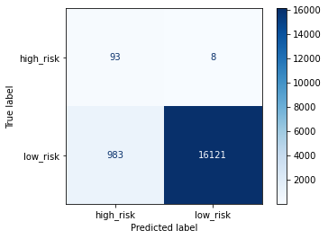

# Credit_Risk_Analysis

## Project Overview
- [View the Resampling Techniques](credit_risk_resampling.ipynb)
- [View the Ensemble Learners](credit_risk_ensemble.ipynb)

### Purpose
The purpose of this project is to implement different techniques to train and evaluate models with unbalanced classes. Resampling is used to build and evaluate the models with the `imbalanced-learn` and `scikit-learn` libraries. Then, two machine learning models will be used for reducing bias and will be compared, `BalancedRandomForestClassifier` and `EasyEnsembleClassifier`.  Using these algorithms a balanced accuracy score, confusion matrix and classification report will be created. The credit dataset is from LendingClub, a peer-to-peer lending service company.

This project aims to implement different techniques to train and evaluate models with unbalanced classes. First, resampling is used to build and evaluate the models with the `imbalanced-learn` and `scikit-learn` libraries. Then, two machine learning models will be used to reduce bias and be compared, `BalancedRandomForestClassifier` and `EasyEnsembleClassifier`. Utilizing these algorithms will create a balanced accuracy score, confusion matrix, and classification report. The credit dataset is from LendingClub, a peer-to-peer lending service company.

Resampling
1. Oversampled using `RandomOverSample` and `SMOTE`
2. Undersampled using `ClusterCentroids`
3. Combinatorial of over-and undersampling using `SMOTEEN`

Ensemble Classifiers
1. Using `BalancedRandomForestClassifier`
2. Using `EasyEnsembleClassifier`

## Results
### Resampling

|                | **Original Dataset Shape** | **RandomOverSample** | **SMOTE** | **ClusterCentroids** | **SMOTEENN** |
|:---------------|:--------------------------:|:--------------------:|:---------:|:--------------------:|:------------:|
| **Low Risk**   |            68470           |         51366        |   51366   |          246         |     51361    |
| **Hish Risk**  |             347            |         51366        |   51366   |          246         |     46653    |

#### Random Oversample
Over-sample the minority class(es) by picking samples at random with replacement.
- Balanced Accuracy Score: 0.646
- Precision: 0.991
  - High Risk: 0.010
  - Low Risk: 0.997
- Recall: 0.581
  - High Risk: 0.713
  - Low Risk: 0.580

#### SMOTE Oversample
Implementation of SMOTE - Synthetic Minority Over-sampling Technique.
- Balanced Accuracy Score: 0.658
- Precision: .911
  - High Risk: 0.012
  - Low Risk: 0.997
- Recall: 0.683
  - High Risk: 0.634
  - Low Risk: 0.684

#### Cluster Centroids Undersample
Undersample by generating centroids based on clustering methods.
- Balanced Accuracy Score: 0.544
- Precision: 0.990
  - High Risk: 0.007
  - Low Risk: 0.995
- Recall: 0.398
  - High Risk: 0.693
  - Low Risk: 0.396

#### SMOTEEENN Combination Sampling
Combine over- and under-sampling using SMOTE and Edited Nearest Neighbours.
- Balanced Accuracy Score: 0.636
- Precision: 0.991
  - High Risk: 0.010
  - Low Risk: 0.997
- Recall: 0.590
  - High Risk: 0.683
  - Low Risk: 0.589

### Ensemble Classifiers

#### BalancedRandomForestClassifier
A balanced random forest randomly under-samples each boostrap sample to balance it.
- Balanced Accuracy Score: 0.788
- Precision: 0.99
  - High Risk: 0.03
  - Low Risk: 1.00
- Recall: 0.87
  - High Risk: 0.70
  - Low Risk: 0.87

#### EasyEnsembleClassifier
The classifier is an ensemble of AdaBoost learners trained on different balanced boostrap samples. The balancing is achieved by random under-sampling.
- Balanced Accuracy Score: 0.931
- Precision: 0.99
  - High Risk: 0.09
  - Low Risk: 1.00
- Recall: 0.94
  - High Risk: 0.92
  - Low Risk: 0.94

## Summary

|                          | **Balanced Accuracy Score** | **Precision** | **Precision_high_risk** | **Precision_low_risk** | **Recall** | **Recall_high_risk** | **Recall_low_risk** |
|--------------------------|:---------------------------:|:-------------:|:-----------------------:|:----------------------:|:----------:|:--------------------:|:-------------------:|
| **RandomOverSample**     |            0.646            |     0.991     |          0.010          |          0.997         |    0.581   |         0.713        |        0.580        |
| **SMOTE**                |            0.658            |     0.991     |          0.012          |          0.997         |    0.683   |         0.634        |        0.684        |
| **ClusterCentroids**     |            0.544            |     0.990     |          0.007          |          0.995         |    0.398   |         0.693        |        0.396        |
| **SMOTEENN**             |            0.636            |     0.991     |          0.010          |          0.997         |    0.590   |         0.683        |        0.589        |
| **BalancedRandomForest** |            0.789            |     0.990     |          0.030          |          1.000         |    0.870   |         0.700        |        0.870        |
| **EasyEnsemble**         |            0.931            |     0.990     |          0.090          |          1.000         |    0.940   |         0.920        |        0.940        |
